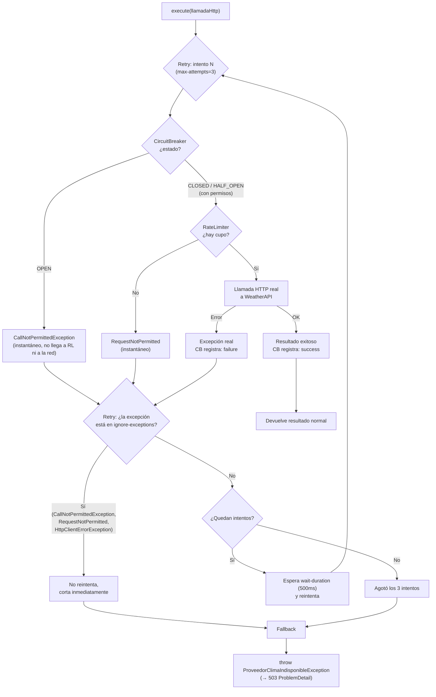

# Diagrama de resiliencia WeatherAPI

```mermaid
flowchart TD
    A["execute(llamadaHttp)"] --> B{"Retry: intento N<br/>(max-attempts=3)"}
    B --> C{"CircuitBreaker<br/>¿estado?"}
    C -- OPEN --> D["CallNotPermittedException<br/>(instantáneo, no llega a RL ni a la red)"]
    C -- "CLOSED / HALF_OPEN<br/>(con permisos)" --> E{"RateLimiter<br/>¿hay cupo?"}
    E -- No --> F["RequestNotPermitted<br/>(instantáneo)"]
    E -- Sí --> G["Llamada HTTP real<br/>a WeatherAPI"]
    G -- OK --> H["Resultado exitoso<br/>CB registra: success"]
    G -- Error --> I["Excepción real<br/>CB registra: failure"]
    D --> J{"Retry: ¿la excepción<br/>está en ignore-exceptions?"}
    F --> J
    I --> J
    J -- "Sí (CallNotPermittedException,<br/>RequestNotPermitted,<br/>HttpClientErrorException)" --> K["No reintenta,<br/>corta inmediatamente"]
    J -- No --> L{"¿Quedan intentos?"}
    L -- Sí --> M["Espera wait-duration (500ms)<br/>y reintenta"] --> B
    L -- No --> N["Agotó los 3 intentos"]
    K --> O["Fallback"]
    N --> O
    H --> P["Devuelve resultado normal"]
    O --> Q["throw ProveedorClimaIndisponibleException<br/>(→ 503 ProblemDetail)"]
```